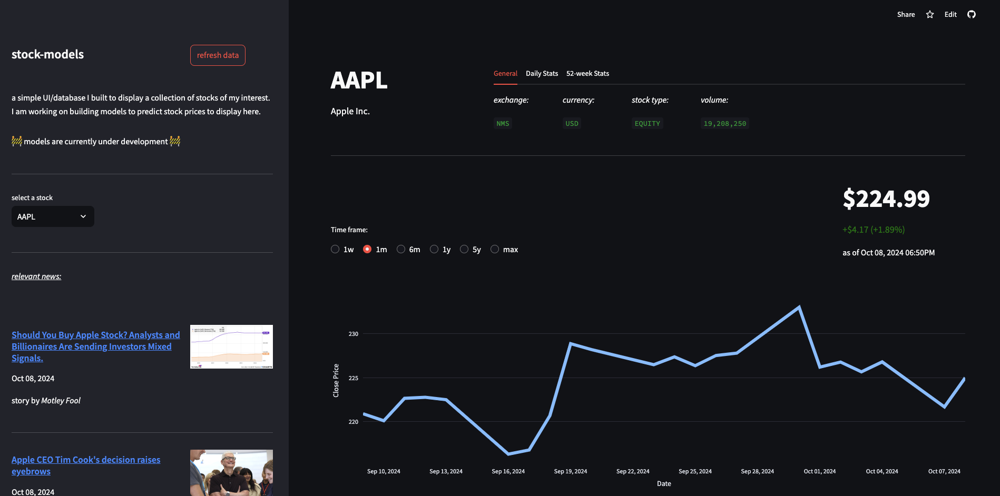

## stock-models

This repo will hold ML models I've created for predicting prices of different stocks. 
I also built a database and UI to visualize stock data and model performance. 

### technologies

- **back-end:** Python, yfinance API, psycopg2, PostgreSQL, Vercel Hosting
- **front-end:** Python, Streamlit, plotly
<!-- - **data analysis/ML:** Python, Jupyter Notebook, scikit-learn -->

### hosted project
[](https://stock-models.streamlit.app/)


<!-- ### setup

clone the repo
```bash
git clone https://github.com/marcolanfranchi/stock-models.git
```
 navigate to root directory
```bash
cd stock-models
```

create a virtual environment for packages
```bash
python -m venv venv
```

activate the virtual environment
```bash
source venv/bin/activate
```

install required packages
```bash
pip install -r 'requirements.txt'
```

run the ui
```bash
streamlit run ui/app.py
```
 -->
